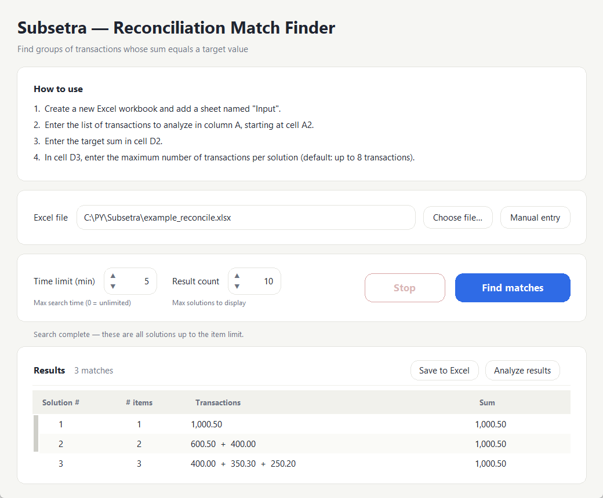
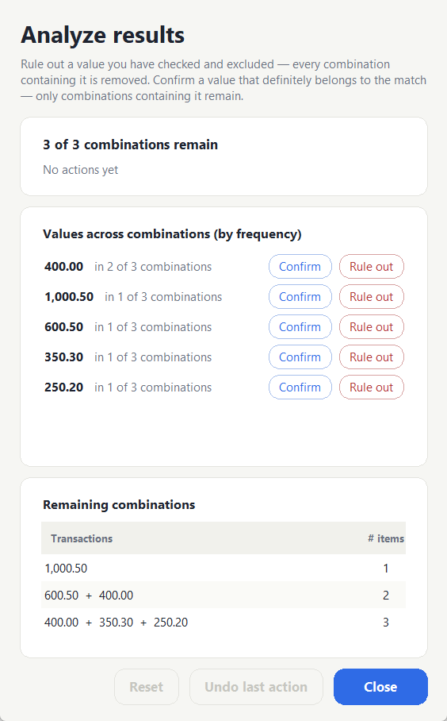
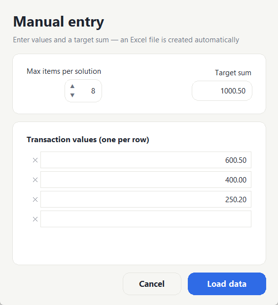

# Subsetra — Reconciliation Match Finder

> Given a list of transaction amounts and a target sum, find every subset of
> transactions that adds up to the target **exactly** — to the cent.


Subsetra is a small, self-contained desktop tool for **bookkeeping
reconciliation**: you have a pile of transactions and a known total (a bank
line, an invoice, a statement balance), and you need to know *which*
transactions make up that total. That is the classic
[Subset Sum problem](https://en.wikipedia.org/wiki/Subset_sum_problem) — NP-hard
in general. Subsetra handles practical instances of it using exact integer
arithmetic and a branch-and-bound search.

<p align="center">
  
</p>

---

## Why it exists

A spreadsheet that enumerates every subset (`2^n`) becomes impractical around
~24 transactions. Subsetra aims to stay usable at larger sizes (roughly 50–200
transactions) by combining a cents/whole-unit decomposition with length-aware
pruning, so it explores only part of the search space. It returns the shortest
matches first, and it is bounded: a time limit, a result cap, and `Ctrl+C` / a
Stop button mean it always returns whatever it has found so far.

## Features

- **Exact, to-the-cent matching.** All arithmetic is done in integer *cents*,
  never floats, so accounting amounts are never mis-summed by rounding.
- **Handles longer lists.** Decomposes the problem into a cents subproblem and
  a whole-unit subproblem (see [`DESIGN.md`](DESIGN.md)).
- **Shortest solutions first**, up to a configurable result cap.
- **Negatives and zero targets supported** — credits/refunds, and finding
  entries that cancel out (e.g. `+500` and `−500`).
- **Excel in, Excel out.** Reads an `Input` sheet, writes a formatted `Output`
  sheet. Or skip Excel with the built-in **manual entry**.
- **Results-analysis window** to help narrow many matches toward the right one:
  rule out / confirm individual values and watch the candidate set shrink, with
  each step appended as its own sheet in the workbook.
- **Stays responsive.** The search runs on a worker thread, with a time limit
  and a Stop button.
- **Tested.** A regression suite plus a fuzzer that checks results against a
  brute-force oracle and keeps a corpus of past failures as permanent
  regression cases.

## Screenshots

| Analyze & narrow results | Manual entry |
| --- | --- |
|  |  |

---

## Installation

Requires **Python 3.10+**.

```bash
git clone https://github.com/<your-username>/Subsetra.git
cd Subsetra
pip install -r requirements.txt
```

Dependencies: [`openpyxl`](https://openpyxl.readthedocs.io/) (Excel I/O) and
[`Pillow`](https://python-pillow.org/) (only for regenerating the app icon).
The GUI uses **Tkinter**, which ships with the standard CPython installer.

## Usage

### 1. Prepare the input

Create an Excel workbook with a sheet named **`Input`**:

| Cell | Meaning |
| --- | --- |
| `A1` | header `Transactions` |
| `A2`, `A3`, … | the transaction amounts, one per row |
| `D2` | the **target sum** |
| `D3` | max number of transactions per solution (optional; default 8) |

A ready-made `example_reconcile.xlsx` is included (run `python make_example.py`
to regenerate it). Non-numeric cells and amounts larger than the target are
skipped automatically.

### 2. Run the GUI

```bash
python reconcile_gui.py
```

Pick the Excel file (or use **Manual entry**), set a time limit and result
count, and click **Find matches**. Results appear in the table and are written
to an `Output` sheet. With more than one match, **Analyze results** opens the
narrowing window.

### 3. Or use the CLI

```bash
python subset_sum_reconcile.py example_reconcile.xlsx --minutes 1
```

Omit `--minutes` to be prompted. Solutions are printed and written back to the
`Output` sheet. Stop anytime with `Ctrl+C` — whatever was found is kept.

---

## How it works

The short version: amounts are converted to integer cents; transactions are
split into *round* (whole-unit) and *non-round* (have cents) groups; the search
first solves the **cents subproblem** modulo 100 on the non-round group, then
completes each candidate with round transactions; the whole thing runs as an
**iterative-deepening, branch-and-bound DFS** with two-sided bounds, so it
returns the shortest solutions first and prunes the search early.

The full walkthrough — with the reasoning behind each pruning rule — is in
**[`DESIGN.md`](DESIGN.md)**, written to be read for learning.

> Amounts are treated as generic values with up to two decimal places, and are
> handled internally as integer **minor units** (cents). The tool is
> currency-agnostic — any currency with 100 minor units works, and no currency
> symbol is shown.

## Building a standalone executable (Windows)

A [PyInstaller](https://pyinstaller.org/) spec is included:

```bash
pip install pyinstaller
python -m PyInstaller Subsetra.spec --noconfirm
```

This produces a single self-contained `dist/Subsetra.exe` (with the bundled
abacus icon and embedded version metadata from `version.txt`).

## Testing

```bash
python test_reconcile.py          # deterministic regression suite (must print "0 failed")
python test_reconcile.py --fuzz   # fresh random cases vs. a brute-force oracle
```

The fuzzer accumulates coverage in `test_log.json` and saves any failing case
to `fuzz_failures.jsonl`, which is then replayed as a permanent regression on
every run — so a bug found once can never silently come back. See
[`DESIGN.md`](DESIGN.md#testing) for the oracle strategy.

## Project layout

```
subset_sum_reconcile.py   # the engine + CLI (the core algorithm lives here)
reconcile_gui.py          # Tkinter GUI (search, analysis window, Excel I/O)
test_reconcile.py         # regression + fuzz test suite
make_example.py           # generates example_reconcile.xlsx
make_icon.py              # generates the abacus app icon (Pillow)
Subsetra.spec             # PyInstaller build spec
version.txt               # Windows version/metadata resource
docs/                     # screenshots
DESIGN.md                 # algorithm deep-dive
```

## License

[MIT](LICENSE) © 2026 Elad Dafni. Feedback and suggestions are welcome.
